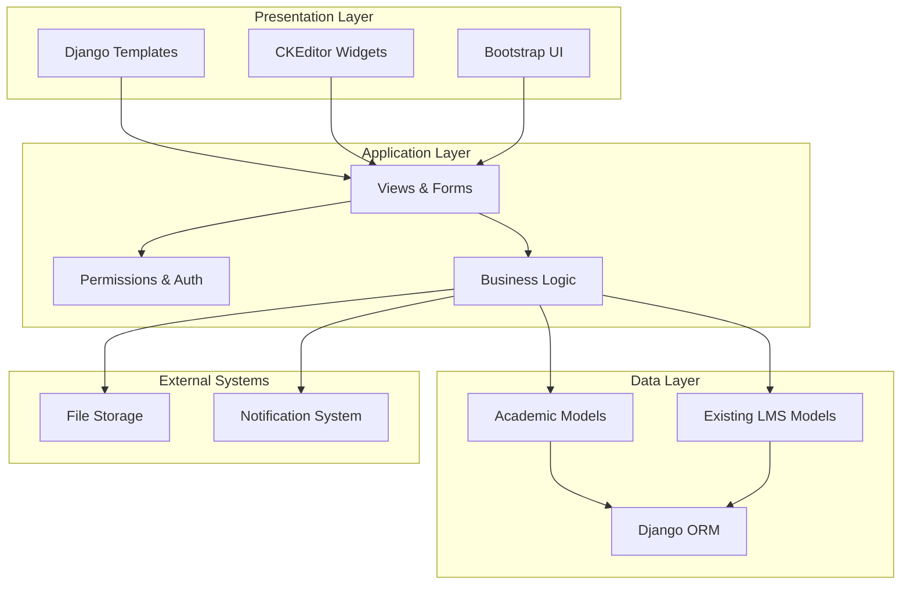
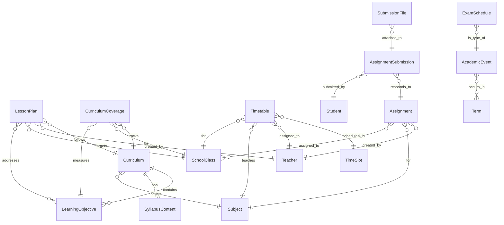

# Design Document: Academic Management System

## Overview

The Academic Management system extends the existing Django-based LMS with comprehensive tools for curriculum management, lesson planning, academic calendars, timetables, and assignment management. The system follows Django best practices and integrates seamlessly with existing models while providing rich content editing capabilities through CKEditor.

The architecture emphasizes modularity, data integrity, and role-based access control. Each component is designed to work independently while maintaining strong relationships with existing LMS infrastructure.

## Architecture

### High-Level Architecture



### Component Architecture

The system is organized into five main modules:

1. **Curriculum Management**: Handles curriculum structures, learning objectives, and syllabus content
2. **Lesson Planning**: Manages lesson plans and curriculum coverage tracking
3. **Academic Calendar**: Manages events, holidays, and scheduling
4. **Timetable Management**: Handles class schedules, teacher assignments, and room allocations
5. **Assignment Management**: Manages homework assignments and submission tracking

Each module follows the Django MVT (Model-View-Template) pattern with clear separation of concerns.

## Components and Interfaces

### Curriculum Management Component

**Models:**
- `Curriculum`: Main curriculum entity with metadata and relationships
- `LearningObjective`: Specific educational goals within curricula
- `SyllabusContent`: Rich text content associated with curricula

**Key Interfaces:**
- `CurriculumManager`: Custom manager for curriculum queries and operations
- `CurriculumForm`: Django form with CKEditor integration for rich content
- `CurriculumViewSet`: API endpoints for curriculum operations

**Integration Points:**
- Links to existing `Subject` and `Term` models
- Integrates with Django's permission system for role-based access
- Uses CKEditor for rich text syllabus content

### Lesson Planning Component

**Models:**
- `LessonPlan`: Individual lesson plans with rich content
- `CurriculumCoverage`: Tracking completion of learning objectives

**Key Interfaces:**
- `LessonPlanForm`: Form with CKEditor for lesson content creation
- `CoverageTracker`: Service class for calculating completion percentages
- `LessonPlanManager`: Custom manager for teacher-specific queries

**Integration Points:**
- References `Curriculum` and `LearningObjective` models
- Links to existing `Teacher`, `Subject`, and `SchoolClass` models
- Integrates with timetable system for automatic scheduling

### Academic Calendar Component

**Models:**
- `AcademicEvent`: Calendar events with type classification
- `Holiday`: Special non-instructional days
- `ExamSchedule`: Exam-specific calendar entries

**Key Interfaces:**
- `CalendarManager`: Handles event queries and conflict detection
- `EventForm`: Form for creating and editing calendar events
- `CalendarAPI`: RESTful interface for calendar operations

**Integration Points:**
- Uses existing `Term` model for academic period alignment
- Integrates with notification system for event updates
- Links to timetable system for scheduling validation

### Timetable Management Component

**Models:**
- `TimeSlot`: Defines time periods for scheduling
- `Timetable`: Main scheduling entity linking all components
- `RoomAssignment`: Tracks room allocations

**Key Interfaces:**
- `TimetableBuilder`: Service for creating and validating timetables
- `ConflictDetector`: Validates scheduling conflicts
- `ScheduleView`: Display interface for different user roles

**Integration Points:**
- References existing `Teacher`, `Subject`, and `SchoolClass` models
- Integrates with academic calendar for holiday awareness
- Links to lesson planning for curriculum alignment

### Assignment Management Component

**Models:**
- `Assignment`: Homework assignments with rich content
- `AssignmentSubmission`: Student submission tracking
- `SubmissionFile`: File attachments for submissions

**Key Interfaces:**
- `AssignmentForm`: Form with CKEditor and file upload support
- `SubmissionTracker`: Service for monitoring submission status
- `DeadlineManager`: Handles deadline calculations and notifications

**Integration Points:**
- Links to existing `Student`, `Teacher`, and `SchoolClass` models
- Uses Django's file storage system for attachments
- Integrates with academic calendar for deadline validation

## Data Models

### Core Academic Models

```python
# Curriculum Management Models
class Curriculum(models.Model):
    title = models.CharField(max_length=200)
    description = models.TextField()
    academic_year = models.CharField(max_length=9)  # e.g., "2024-2025"
    subjects = models.ManyToManyField('Subject')
    created_by = models.ForeignKey('User', on_delete=models.CASCADE)
    created_at = models.DateTimeField(auto_now_add=True)
    updated_at = models.DateTimeField(auto_now=True)
    is_published = models.BooleanField(default=False)

class LearningObjective(models.Model):
    curriculum = models.ForeignKey(Curriculum, on_delete=models.CASCADE)
    title = models.CharField(max_length=300)
    description = models.TextField()
    subject = models.ForeignKey('Subject', on_delete=models.CASCADE)
    grade_level = models.CharField(max_length=50)
    order = models.PositiveIntegerField()

class SyllabusContent(models.Model):
    curriculum = models.ForeignKey(Curriculum, on_delete=models.CASCADE)
    subject = models.ForeignKey('Subject', on_delete=models.CASCADE)
    content = RichTextField()  # CKEditor field
    order = models.PositiveIntegerField()

# Lesson Planning Models
class LessonPlan(models.Model):
    title = models.CharField(max_length=200)
    curriculum = models.ForeignKey(Curriculum, on_delete=models.CASCADE)
    subject = models.ForeignKey('Subject', on_delete=models.CASCADE)
    school_class = models.ForeignKey('SchoolClass', on_delete=models.CASCADE)
    teacher = models.ForeignKey('Teacher', on_delete=models.CASCADE)
    learning_objectives = models.ManyToManyField(LearningObjective)
    content = RichTextField()  # CKEditor field
    resources = models.TextField(blank=True)
    estimated_duration = models.DurationField()
    is_completed = models.BooleanField(default=False)
    completion_date = models.DateTimeField(null=True, blank=True)
    created_at = models.DateTimeField(auto_now_add=True)

class CurriculumCoverage(models.Model):
    curriculum = models.ForeignKey(Curriculum, on_delete=models.CASCADE)
    school_class = models.ForeignKey('SchoolClass', on_delete=models.CASCADE)
    learning_objective = models.ForeignKey(LearningObjective, on_delete=models.CASCADE)
    completed_lessons = models.PositiveIntegerField(default=0)
    total_planned_lessons = models.PositiveIntegerField(default=1)
    completion_percentage = models.DecimalField(max_digits=5, decimal_places=2, default=0.00)
    last_updated = models.DateTimeField(auto_now=True)

# Academic Calendar Models
class AcademicEvent(models.Model):
    EVENT_TYPES = [
        ('holiday', 'Holiday'),
        ('exam', 'Exam'),
        ('meeting', 'Meeting'),
        ('activity', 'Activity'),
        ('deadline', 'Deadline'),
    ]
    
    title = models.CharField(max_length=200)
    description = models.TextField(blank=True)
    event_type = models.CharField(max_length=20, choices=EVENT_TYPES)
    start_date = models.DateTimeField()
    end_date = models.DateTimeField()
    is_recurring = models.BooleanField(default=False)
    recurrence_pattern = models.CharField(max_length=50, blank=True)
    academic_year = models.CharField(max_length=9)
    terms = models.ManyToManyField('Term', blank=True)
    created_by = models.ForeignKey('User', on_delete=models.CASCADE)

class Holiday(models.Model):
    name = models.CharField(max_length=100)
    date = models.DateField()
    is_recurring = models.BooleanField(default=False)
    academic_year = models.CharField(max_length=9)

class ExamSchedule(models.Model):
    subject = models.ForeignKey('Subject', on_delete=models.CASCADE)
    school_class = models.ForeignKey('SchoolClass', on_delete=models.CASCADE)
    exam_date = models.DateTimeField()
    duration = models.DurationField()
    room = models.CharField(max_length=50, blank=True)
    invigilator = models.ForeignKey('Teacher', on_delete=models.SET_NULL, null=True)
    academic_event = models.OneToOneField(AcademicEvent, on_delete=models.CASCADE)

# Timetable Models
class TimeSlot(models.Model):
    name = models.CharField(max_length=50)  # e.g., "Period 1"
    start_time = models.TimeField()
    end_time = models.TimeField()
    day_of_week = models.IntegerField()  # 0=Monday, 6=Sunday
    is_active = models.BooleanField(default=True)

class Timetable(models.Model):
    time_slot = models.ForeignKey(TimeSlot, on_delete=models.CASCADE)
    subject = models.ForeignKey('Subject', on_delete=models.CASCADE)
    teacher = models.ForeignKey('Teacher', on_delete=models.CASCADE)
    school_class = models.ForeignKey('SchoolClass', on_delete=models.CASCADE)
    room = models.CharField(max_length=50)
    term = models.ForeignKey('Term', on_delete=models.CASCADE)
    academic_year = models.CharField(max_length=9)
    is_active = models.BooleanField(default=True)

class RoomAssignment(models.Model):
    room_name = models.CharField(max_length=50)
    capacity = models.PositiveIntegerField()
    room_type = models.CharField(max_length=50)  # e.g., "Classroom", "Lab", "Hall"
    is_available = models.BooleanField(default=True)

# Assignment Models
class Assignment(models.Model):
    title = models.CharField(max_length=200)
    description = RichTextField()  # CKEditor field
    subject = models.ForeignKey('Subject', on_delete=models.CASCADE)
    teacher = models.ForeignKey('Teacher', on_delete=models.CASCADE)
    school_classes = models.ManyToManyField('SchoolClass')
    due_date = models.DateTimeField()
    max_score = models.DecimalField(max_digits=5, decimal_places=2, null=True, blank=True)
    allow_late_submission = models.BooleanField(default=False)
    late_penalty_percentage = models.DecimalField(max_digits=5, decimal_places=2, default=0.00)
    attachment = models.FileField(upload_to='assignments/', blank=True)
    created_at = models.DateTimeField(auto_now_add=True)
    updated_at = models.DateTimeField(auto_now=True)

class AssignmentSubmission(models.Model):
    assignment = models.ForeignKey(Assignment, on_delete=models.CASCADE)
    student = models.ForeignKey('Student', on_delete=models.CASCADE)
    submission_text = RichTextField(blank=True)  # CKEditor field
    submitted_at = models.DateTimeField(auto_now_add=True)
    is_late = models.BooleanField(default=False)
    score = models.DecimalField(max_digits=5, decimal_places=2, null=True, blank=True)
    feedback = models.TextField(blank=True)

class SubmissionFile(models.Model):
    submission = models.ForeignKey(AssignmentSubmission, on_delete=models.CASCADE)
    file = models.FileField(upload_to='submissions/')
    original_filename = models.CharField(max_length=255)
    uploaded_at = models.DateTimeField(auto_now_add=True)
```

### Database Relationships



## Correctness Properties

*A property is a characteristic or behavior that should hold true across all valid executions of a system—essentially, a formal statement about what the system should do. Properties serve as the bridge between human-readable specifications and machine-verifiable correctness guarantees.*

Before defining the correctness properties, I need to analyze the acceptance criteria from the requirements document to determine which ones are testable as properties.

### Property 1: Content Storage and Association
*For any* academic content (curriculum, lesson plan, assignment) with rich text fields, storing the content should preserve all formatting and maintain correct associations with related entities (subjects, classes, objectives).
**Validates: Requirements 1.1, 1.3, 2.3, 4.1, 7.2**

### Property 2: Required Field Validation
*For any* academic entity creation (curriculum, lesson plan, assignment, timetable), the system should reject entities that lack required fields or associations and accept those with complete data.
**Validates: Requirements 1.5, 2.1, 2.4, 5.1, 7.1**

### Property 3: Role-Based Access Control
*For any* user and academic data, the system should display only data relevant to the user's role and associated classes/subjects, filtering out unauthorized content.
**Validates: Requirements 1.6, 6.1, 7.4, 9.1, 10.1, 11.4**

### Property 4: Coverage Tracking Updates
*For any* lesson plan marked as completed, the system should automatically update curriculum coverage percentages for all associated learning objectives and classes.
**Validates: Requirements 2.5, 3.2**

### Property 5: Coverage Calculation Accuracy
*For any* curriculum objective and class, the coverage percentage should equal (completed lessons / total planned lessons) × 100, rounded to two decimal places.
**Validates: Requirements 3.1, 3.3**

### Property 6: Scheduling Conflict Detection
*For any* timetable entry, the system should reject entries that create teacher double-booking or room conflicts during the same time slot.
**Validates: Requirements 5.2, 5.3**

### Property 7: Calendar Integration and Validation
*For any* assignment due date or exam schedule, the system should reject dates that fall on holidays or non-instructional days as defined in the academic calendar.
**Validates: Requirements 4.2, 4.6, 7.3**

### Property 8: Assignment Submission Tracking
*For any* assignment submission, the system should record accurate timestamps, associate submissions with correct students and assignments, and automatically mark late submissions based on due dates.
**Validates: Requirements 8.1, 8.4, 9.4**

### Property 9: Data Relationship Integrity
*For any* academic management record creation or modification, the system should validate all foreign key relationships with existing models and maintain referential integrity.
**Validates: Requirements 11.1, 11.2, 11.3**

### Property 10: Recurring Event Generation
*For any* recurring academic event, the system should generate the correct sequence of event instances based on the specified pattern (daily, weekly, monthly, yearly) within the academic year boundaries.
**Validates: Requirements 4.4**

### Property 11: File Upload and Validation
*For any* file upload (assignment attachments, submissions), the system should validate file types, store files securely, and maintain associations with the correct records.
**Validates: Requirements 7.2, 8.2**

### Property 12: Automatic Time Calculations
*For any* time-sensitive academic data (assignment deadlines, lesson completion dates), the system should calculate time remaining and priority indicators accurately based on current timestamps.
**Validates: Requirements 2.6, 7.5, 9.5**

### Property 13: Report Generation Accuracy
*For any* academic report (coverage reports, submission statistics), the system should calculate metrics accurately from underlying data and include all required information fields.
**Validates: Requirements 3.4, 3.5, 8.5**

### Property 14: Learning Objective Association
*For any* lesson plan or curriculum, the system should correctly associate learning objectives with their parent curriculum and make them available for lesson plan selection.
**Validates: Requirements 1.2, 2.2**

### Property 15: Calendar Event Updates
*For any* calendar event modification, the system should immediately reflect changes in all relevant user views while maintaining event data consistency.
**Validates: Requirements 10.2, 10.4**

## Error Handling

The Academic Management system implements comprehensive error handling across all components:

### Validation Errors
- **Model Validation**: Django model validation ensures data integrity at the database level
- **Form Validation**: Custom form validators check business rules before data persistence
- **File Upload Validation**: File type, size, and security validation for all uploads
- **Date Validation**: Calendar integration prevents scheduling on invalid dates

### Conflict Resolution
- **Scheduling Conflicts**: Clear error messages with suggested alternatives for timetable conflicts
- **Resource Conflicts**: Room and teacher availability checking with conflict prevention
- **Deadline Conflicts**: Assignment due date validation against academic calendar

### Permission Errors
- **Role-Based Access**: Proper HTTP 403 responses for unauthorized access attempts
- **Data Filtering**: Silent filtering of unauthorized data rather than error responses
- **Action Restrictions**: Clear messaging when users attempt unauthorized actions

### System Integration Errors
- **Foreign Key Violations**: Graceful handling of referential integrity issues
- **CKEditor Failures**: Fallback to plain text input when rich text editor fails
- **File Storage Errors**: Proper error handling for file upload and storage failures

### User Experience
- **Friendly Error Messages**: Non-technical error messages for end users
- **Validation Feedback**: Real-time form validation with helpful guidance
- **Recovery Suggestions**: Actionable suggestions for resolving errors

## Testing Strategy

The Academic Management system employs a comprehensive dual testing approach combining unit tests and property-based tests to ensure correctness and reliability.

### Property-Based Testing

Property-based tests validate universal properties across all inputs using **Hypothesis** (Python's property-based testing library). Each property test runs a minimum of 100 iterations with randomly generated data to ensure comprehensive coverage.

**Property Test Configuration:**
- Library: Hypothesis for Python/Django
- Iterations: Minimum 100 per property test
- Test Tagging: Each test references its design document property
- Tag Format: **Feature: academic-management, Property {number}: {property_text}**

**Property Test Coverage:**
- Content storage and rich text handling across all models
- Validation rules for required fields and associations
- Role-based access control across all user types
- Coverage calculation accuracy and automatic updates
- Scheduling conflict detection and prevention
- Calendar integration and date validation
- Assignment submission tracking and late detection
- Data relationship integrity and foreign key validation
- File upload handling and validation
- Time-based calculations and deadline management
- Report generation accuracy and completeness

### Unit Testing

Unit tests complement property tests by focusing on specific examples, edge cases, and integration points:

**Core Unit Test Areas:**
- **Model Tests**: Specific model creation, validation, and relationship scenarios
- **View Tests**: HTTP response handling, form processing, and template rendering
- **Form Tests**: Specific validation scenarios and CKEditor integration
- **Manager Tests**: Custom query methods and business logic
- **Integration Tests**: Django admin integration and existing model compatibility

**Edge Case Coverage:**
- Empty content handling in rich text fields
- Boundary conditions for date ranges and time calculations
- File upload edge cases (empty files, invalid types, large files)
- Permission edge cases (role transitions, class reassignments)
- Calendar edge cases (leap years, timezone handling, recurring events)

**Error Condition Testing:**
- Invalid foreign key references
- Malformed rich text content
- File upload failures
- Database constraint violations
- Permission denied scenarios

### Test Organization

```python
# Example test structure
class CurriculumPropertyTests(TestCase):
    """Property-based tests for curriculum management"""
    
    @given(curriculum_data=curriculum_strategy())
    def test_content_storage_property(self, curriculum_data):
        """Feature: academic-management, Property 1: Content Storage and Association"""
        # Property test implementation
        
class CurriculumUnitTests(TestCase):
    """Unit tests for specific curriculum scenarios"""
    
    def test_curriculum_creation_with_ckeditor_content(self):
        """Test specific CKEditor content handling"""
        # Unit test implementation
        
    def test_curriculum_without_learning_objectives_rejected(self):
        """Test validation edge case"""
        # Unit test implementation
```

### Integration Testing

**Django Integration:**
- Admin interface functionality with custom models
- CKEditor integration across all rich text fields
- File upload handling through Django's storage system
- Permission system integration with existing roles

**Database Integration:**
- Foreign key constraint enforcement
- Cascade deletion behavior
- Transaction handling for complex operations
- Database performance with large datasets

**External System Integration:**
- File storage system integration
- Email notification system integration (when implemented)
- Existing LMS model compatibility

### Performance Testing

While not part of the core testing strategy, performance considerations include:
- Database query optimization testing
- File upload performance validation
- Large dataset handling verification
- Concurrent user access testing

### Continuous Integration

All tests must pass before code deployment:
- Property tests run with extended iteration counts in CI
- Unit tests provide fast feedback during development
- Integration tests validate system compatibility
- Coverage reports ensure comprehensive test coverage

The dual testing approach ensures both correctness (through property tests) and reliability (through unit tests), providing confidence in the system's behavior across all scenarios and edge cases.