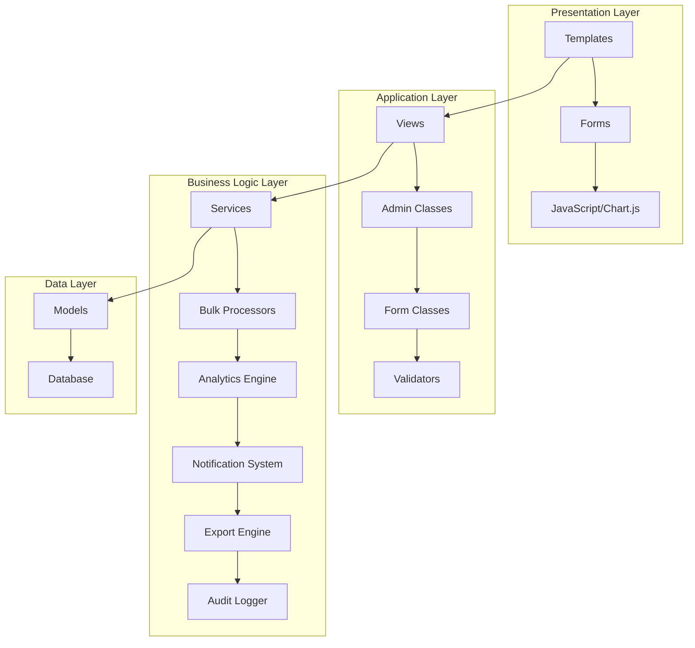

# Design Document: Financial Management Enhancement

## Overview

This design document outlines the comprehensive enhancement of the existing Django school management application's financial system. The enhancement transforms the basic financial management capabilities into a professional, feature-rich platform with modern templates, advanced filtering, comprehensive admin interfaces, robust form validation, bulk operations, financial analytics, audit logging, notification systems, enhanced reporting, and multi-format export capabilities.

The design leverages Django's built-in capabilities including ModelAdmin customization, form validation framework, template system, and integrates modern JavaScript libraries like Chart.js for data visualization. The architecture follows Django best practices with clear separation of concerns, proper model relationships, and scalable component design.

## Architecture

### System Architecture

The enhanced financial management system follows a layered architecture pattern:



### Component Architecture

The system is organized into specialized components:

1. **Template Engine**: Responsive HTML templates with Bootstrap styling
2. **Filter System**: Advanced filtering and search capabilities
3. **Admin Interface**: Customized Django admin with inline editing and bulk actions
4. **Form Validation**: Comprehensive client and server-side validation
5. **Bulk Processor**: Efficient bulk operations with progress tracking
6. **Analytics Engine**: Chart.js integration for data visualization
7. **Audit Logger**: Immutable transaction logging system
8. **Notification System**: Email-based reminder and notification system
9. **Export Engine**: Multi-format export capabilities (PDF, Excel, CSV)
10. **Reconciliation Engine**: Automated financial reconciliation and validation

## Components and Interfaces

### Template System Components

#### Base Template Structure
```python
# Template hierarchy
templates/
├── financial/
│   ├── base_financial.html          # Base template for financial modules
│   ├── dashboard.html               # Enhanced dashboard (existing)
│   ├── fee_management.html          # Enhanced fee management (existing)
│   ├── scholarship/
│   │   ├── list.html               # Scholarship listing with filters
│   │   ├── create.html             # Scholarship creation form
│   │   ├── edit.html               # Scholarship editing form
│   │   └── detail.html             # Scholarship detail view
│   ├── payroll/
│   │   ├── list.html               # Payroll listing with filters
│   │   ├── generate.html           # Payroll generation form
│   │   ├── process.html            # Payroll processing interface
│   │   └── reports.html            # Payroll reports
│   ├── reports/
│   │   ├── analytics.html          # Financial analytics dashboard
│   │   ├── export.html             # Export interface
│   │   └── reconciliation.html     # Reconciliation reports
│   ├── bulk/
│   │   ├── operations.html         # Bulk operations interface
│   │   └── progress.html           # Progress tracking
│   └── audit/
│       ├── logs.html               # Audit log viewer
│       └── search.html             # Audit search interface
```

#### Template Features
- Responsive Bootstrap 5 design
- HTMX integration for dynamic content loading
- Chart.js integration for data visualization
- Progressive enhancement with JavaScript
- Accessibility compliance (WCAG 2.1)
- Mobile-first responsive design

### Filter System Components

#### Advanced Filtering Interface
```python
class FinancialFilterMixin:
    """Base mixin for financial filtering capabilities"""
    
    def get_filter_context(self):
        return {
            'date_ranges': self.get_date_range_options(),
            'status_choices': self.get_status_choices(),
            'amount_ranges': self.get_amount_range_options(),
            'search_fields': self.get_search_fields()
        }
    
    def apply_filters(self, queryset, filters):
        """Apply multiple filters to queryset"""
        if filters.get('date_from'):
            queryset = queryset.filter(created_at__gte=filters['date_from'])
        if filters.get('date_to'):
            queryset = queryset.filter(created_at__lte=filters['date_to'])
        if filters.get('status'):
            queryset = queryset.filter(status=filters['status'])
        if filters.get('search'):
            queryset = self.apply_search(queryset, filters['search'])
        return queryset

class StudentFeeFilterView(FinancialFilterMixin, ListView):
    """Enhanced student fee listing with advanced filtering"""
    model = StudentFee
    template_name = 'financial/fee_management.html'
    paginate_by = 25
    
    def get_queryset(self):
        queryset = super().get_queryset()
        filters = self.request.GET
        return self.apply_filters(queryset, filters)
```

### Admin Interface Components

#### Customized ModelAdmin Classes
```python
from django.contrib import admin
from django.db.models import Sum
from django.utils.html import format_html
from .models import *

class FeePaymentInline(admin.TabularInline):
    model = FeePayment
    extra = 0
    readonly_fields = ('payment_date',)
    fields = ('amount', 'payment_method', 'reference_number', 'payment_date', 'received_by', 'notes')

@admin.register(StudentFee)
class StudentFeeAdmin(admin.ModelAdmin):
    list_display = ('student', 'fee_structure', 'total_amount', 'paid_amount', 'balance_display', 'status', 'due_date')
    list_filter = ('status', 'fee_structure__term', 'fee_structure__school_class', 'due_date')
    search_fields = ('student__user__first_name', 'student__user__last_name', 'student__admission_number')
    readonly_fields = ('balance_amount', 'created_at')
    inlines = [FeePaymentInline]
    actions = ['mark_as_paid', 'send_payment_reminders', 'bulk_apply_discount']
    
    def balance_display(self, obj):
        balance = obj.balance_amount
        color = 'red' if balance > 0 else 'green'
        return format_html('<span style="color: {};">${:.2f}</span>', color, balance)
    balance_display.short_description = 'Balance'
    
    def mark_as_paid(self, request, queryset):
        updated = queryset.update(status='paid')
        self.message_user(request, f'{updated} fees marked as paid.')
    mark_as_paid.short_description = 'Mark selected fees as paid'

@admin.register(FeeStructure)
class FeeStructureAdmin(admin.ModelAdmin):
    list_display = ('name', 'school_class', 'term', 'total_fee', 'is_active', 'created_at')
    list_filter = ('is_active', 'term', 'school_class')
    search_fields = ('name', 'school_class__name')
    actions = ['clone_fee_structure', 'activate_structures', 'deactivate_structures']
    
    def clone_fee_structure(self, request, queryset):
        """Clone selected fee structures for different terms/classes"""
        # Implementation for cloning fee structures
        pass
    clone_fee_structure.short_description = 'Clone selected fee structures'

class ScholarshipRecipientInline(admin.TabularInline):
    model = ScholarshipRecipient
    extra = 0
    fields = ('student', 'awarded_amount', 'start_date', 'end_date', 'status')

@admin.register(Scholarship)
class ScholarshipAdmin(admin.ModelAdmin):
    list_display = ('name', 'scholarship_type', 'amount', 'max_recipients', 'current_recipients', 'is_active')
    list_filter = ('scholarship_type', 'is_active', 'academic_year')
    search_fields = ('name', 'description')
    inlines = [ScholarshipRecipientInline]
    actions = ['award_to_eligible_students']
    
    def current_recipients(self, obj):
        return obj.scholarshiprecipient_set.filter(status='active').count()
    current_recipients.short_description = 'Current Recipients'

@admin.register(StaffPayroll)
class StaffPayrollAdmin(admin.ModelAdmin):
    list_display = ('teacher', 'month', 'gross_salary', 'net_salary', 'is_paid', 'payment_date')
    list_filter = ('is_paid', 'month', 'teacher__department')
    search_fields = ('teacher__user__first_name', 'teacher__user__last_name')
    readonly_fields = ('gross_salary', 'tax_deduction', 'pension_deduction', 'net_salary', 'created_at')
    actions = ['process_payroll_payments', 'generate_payroll_slips']
    
    def process_payroll_payments(self, request, queryset):
        """Mark selected payrolls as paid"""
        from django.utils import timezone
        updated = queryset.update(is_paid=True, payment_date=timezone.now())
        self.message_user(request, f'{updated} payrolls processed.')
    process_payroll_payments.short_description = 'Process selected payroll payments'
```

### Form Validation Components

#### Enhanced Form Classes
```python
from django import forms
from django.core.validators import MinValueValidator, MaxValueValidator
from decimal import Decimal
from .models import *

class FinancialBaseForm(forms.ModelForm):
    """Base form with common financial validation"""
    
    def clean_amount_field(self, field_name):
        """Common validation for monetary fields"""
        amount = self.cleaned_data.get(field_name)
        if amount is not None:
            if amount < 0:
                raise forms.ValidationError("Amount cannot be negative.")
            if amount > Decimal('999999.99'):
                raise forms.ValidationError("Amount exceeds maximum allowed value.")
        return amount

class FeeStructureForm(FinancialBaseForm):
    class Meta:
        model = FeeStructure
        fields = '__all__'
        widgets = {
            'tuition_fee': forms.NumberInput(attrs={'class': 'form-control', 'step': '0.01', 'min': '0'}),
            'development_fee': forms.NumberInput(attrs={'class': 'form-control', 'step': '0.01', 'min': '0'}),
            'exam_fee': forms.NumberInput(attrs={'class': 'form-control', 'step': '0.01', 'min': '0'}),
            'library_fee': forms.NumberInput(attrs={'class': 'form-control', 'step': '0.01', 'min': '0'}),
            'sports_fee': forms.NumberInput(attrs={'class': 'form-control', 'step': '0.01', 'min': '0'}),
            'other_fees': forms.NumberInput(attrs={'class': 'form-control', 'step': '0.01', 'min': '0'}),
        }
    
    def clean_tuition_fee(self):
        return self.clean_amount_field('tuition_fee')
    
    def clean_development_fee(self):
        return self.clean_amount_field('development_fee')
    
    def clean(self):
        cleaned_data = super().clean()
        school_class = cleaned_data.get('school_class')
        term = cleaned_data.get('term')
        
        if school_class and term:
            # Check for duplicate fee structure
            existing = FeeStructure.objects.filter(
                school_class=school_class, 
                term=term
            ).exclude(pk=self.instance.pk if self.instance else None)
            
            if existing.exists():
                raise forms.ValidationError(
                    "Fee structure already exists for this class and term."
                )
        
        return cleaned_data

class FeePaymentForm(FinancialBaseForm):
    class Meta:
        model = FeePayment
        fields = ['student_fee', 'amount', 'payment_method', 'reference_number', 'notes']
        widgets = {
            'amount': forms.NumberInput(attrs={'class': 'form-control', 'step': '0.01', 'min': '0.01'}),
            'payment_method': forms.Select(attrs={'class': 'form-control'}),
            'reference_number': forms.TextInput(attrs={'class': 'form-control'}),
            'notes': forms.Textarea(attrs={'class': 'form-control', 'rows': 3}),
        }
    
    def clean_amount(self):
        amount = self.clean_amount_field('amount')
        student_fee = self.cleaned_data.get('student_fee')
        
        if amount and student_fee:
            if amount > student_fee.balance_amount:
                raise forms.ValidationError(
                    f"Payment amount (${amount}) exceeds outstanding balance (${student_fee.balance_amount})."
                )
        
        return amount

class ScholarshipForm(FinancialBaseForm):
    class Meta:
        model = Scholarship
        fields = '__all__'
        widgets = {
            'amount': forms.NumberInput(attrs={'class': 'form-control', 'step': '0.01', 'min': '0'}),
            'percentage': forms.NumberInput(attrs={'class': 'form-control', 'step': '0.01', 'min': '0', 'max': '100'}),
            'max_recipients': forms.NumberInput(attrs={'class': 'form-control', 'min': '1'}),
            'description': forms.Textarea(attrs={'class': 'form-control', 'rows': 4}),
        }
    
    def clean_percentage(self):
        percentage = self.cleaned_data.get('percentage')
        if percentage is not None:
            if percentage < 0 or percentage > 100:
                raise forms.ValidationError("Percentage must be between 0 and 100.")
        return percentage
    
    def clean(self):
        cleaned_data = super().clean()
        amount = cleaned_data.get('amount')
        percentage = cleaned_data.get('percentage')
        
        if not amount and not percentage:
            raise forms.ValidationError("Either amount or percentage must be specified.")
        
        if amount and percentage:
            raise forms.ValidationError("Specify either amount or percentage, not both.")
        
        return cleaned_data
```

### Bulk Operations Components

#### Bulk Processing Service
```python
from django.db import transaction
from django.core.exceptions import ValidationError
from celery import shared_task
import logging

logger = logging.getLogger(__name__)

class BulkOperationService:
    """Service for handling bulk financial operations"""
    
    @staticmethod
    @transaction.atomic
    def bulk_create_fee_structures(fee_data_list):
        """Create multiple fee structures with validation"""
        created_structures = []
        errors = []
        
        for i, fee_data in enumerate(fee_data_list):
            try:
                form = FeeStructureForm(data=fee_data)
                if form.is_valid():
                    fee_structure = form.save()
                    created_structures.append(fee_structure)
                    
                    # Create student fees for all students in the class
                    students = Student.objects.filter(school_class=fee_structure.school_class)
                    for student in students:
                        StudentFee.objects.get_or_create(
                            student=student,
                            fee_structure=fee_structure,
                            defaults={
                                'total_amount': fee_structure.total_fee,
                                'due_date': timezone.now().date() + timedelta(days=30)
                            }
                        )
                else:
                    errors.append(f"Row {i+1}: {form.errors}")
            except Exception as e:
                errors.append(f"Row {i+1}: {str(e)}")
        
        return {
            'created_count': len(created_structures),
            'created_structures': created_structures,
            'errors': errors
        }
    
    @staticmethod
    @transaction.atomic
    def bulk_process_payments(payment_data_list, user):
        """Process multiple payments with validation"""
        processed_payments = []
        errors = []
        
        for i, payment_data in enumerate(payment_data_list):
            try:
                payment_data['received_by'] = user
                form = FeePaymentForm(data=payment_data)
                if form.is_valid():
                    payment = form.save()
                    processed_payments.append(payment)
                else:
                    errors.append(f"Payment {i+1}: {form.errors}")
            except Exception as e:
                errors.append(f"Payment {i+1}: {str(e)}")
        
        return {
            'processed_count': len(processed_payments),
            'processed_payments': processed_payments,
            'errors': errors
        }
    
    @staticmethod
    @shared_task
    def generate_bulk_payroll(month, payroll_structure_id):
        """Generate payroll for all staff members (Celery task)"""
        try:
            payroll_structure = PayrollStructure.objects.get(id=payroll_structure_id)
            teachers = Teacher.objects.all()
            
            created_count = 0
            errors = []
            
            for teacher in teachers:
                try:
                    payroll, created = StaffPayroll.objects.get_or_create(
                        teacher=teacher,
                        month=month,
                        defaults={
                            'payroll_structure': payroll_structure,
                            'gross_salary': payroll_structure.gross_salary,
                            'net_salary': 0
                        }
                    )
                    
                    if created:
                        payroll.calculate_net_salary()
                        created_count += 1
                except Exception as e:
                    errors.append(f"Teacher {teacher}: {str(e)}")
            
            return {
                'created_count': created_count,
                'total_teachers': teachers.count(),
                'errors': errors
            }
        except Exception as e:
            logger.error(f"Bulk payroll generation failed: {str(e)}")
            raise
```

### Analytics Engine Components

#### Chart.js Integration Service
```python
from django.db.models import Sum, Count, Q
from django.utils import timezone
from datetime import datetime, timedelta
import json

class FinancialAnalyticsService:
    """Service for generating financial analytics data"""
    
    @staticmethod
    def get_fee_collection_trends(months=6):
        """Get fee collection trends for the last N months"""
        end_date = timezone.now().date()
        start_date = end_date - timedelta(days=months * 30)
        
        # Group payments by month
        monthly_data = []
        current_date = start_date
        
        while current_date <= end_date:
            month_start = current_date.replace(day=1)
            next_month = (month_start + timedelta(days=32)).replace(day=1)
            
            payments = FeePayment.objects.filter(
                payment_date__date__gte=month_start,
                payment_date__date__lt=next_month
            ).aggregate(total=Sum('amount'))['total'] or 0
            
            monthly_data.append({
                'month': month_start.strftime('%B %Y'),
                'amount': float(payments)
            })
            
            current_date = next_month
        
        return {
            'labels': [item['month'] for item in monthly_data],
            'data': [item['amount'] for item in monthly_data]
        }
    
    @staticmethod
    def get_expense_breakdown():
        """Get expense breakdown by category"""
        expenses = FinancialTransaction.objects.filter(
            transaction_type='expense'
        ).values('category').annotate(
            total=Sum('amount')
        ).order_by('-total')
        
        return {
            'labels': [expense['category'].title() for expense in expenses],
            'data': [float(expense['total']) for expense in expenses]
        }
    
    @staticmethod
    def get_payment_status_distribution():
        """Get distribution of payment statuses"""
        status_data = StudentFee.objects.values('status').annotate(
            count=Count('id')
        ).order_by('status')
        
        return {
            'labels': [item['status'].title() for item in status_data],
            'data': [item['count'] for item in status_data]
        }
    
    @staticmethod
    def get_scholarship_distribution():
        """Get scholarship distribution by type"""
        scholarship_data = ScholarshipRecipient.objects.filter(
            status='active'
        ).values('scholarship__scholarship_type').annotate(
            total_amount=Sum('awarded_amount'),
            count=Count('id')
        )
        
        return {
            'labels': [item['scholarship__scholarship_type'].title() for item in scholarship_data],
            'amounts': [float(item['total_amount']) for item in scholarship_data],
            'counts': [item['count'] for item in scholarship_data]
        }
    
    @staticmethod
    def get_monthly_income_vs_expenses(months=12):
        """Compare monthly income vs expenses"""
        end_date = timezone.now().date()
        start_date = end_date - timedelta(days=months * 30)
        
        monthly_comparison = []
        current_date = start_date
        
        while current_date <= end_date:
            month_start = current_date.replace(day=1)
            next_month = (month_start + timedelta(days=32)).replace(day=1)
            
            # Fee income
            fee_income = FeePayment.objects.filter(
                payment_date__date__gte=month_start,
                payment_date__date__lt=next_month
            ).aggregate(total=Sum('amount'))['total'] or 0
            
            # Other income
            other_income = FinancialTransaction.objects.filter(
                transaction_type='income',
                transaction_date__gte=month_start,
                transaction_date__lt=next_month
            ).aggregate(total=Sum('amount'))['total'] or 0
            
            # Expenses
            expenses = FinancialTransaction.objects.filter(
                transaction_type='expense',
                transaction_date__gte=month_start,
                transaction_date__lt=next_month
            ).aggregate(total=Sum('amount'))['total'] or 0
            
            # Payroll expenses
            payroll_expenses = StaffPayroll.objects.filter(
                month=month_start,
                is_paid=True
            ).aggregate(total=Sum('net_salary'))['total'] or 0
            
            total_income = fee_income + other_income
            total_expenses = expenses + payroll_expenses
            
            monthly_comparison.append({
                'month': month_start.strftime('%B %Y'),
                'income': float(total_income),
                'expenses': float(total_expenses),
                'profit': float(total_income - total_expenses)
            })
            
            current_date = next_month
        
        return {
            'labels': [item['month'] for item in monthly_comparison],
            'income': [item['income'] for item in monthly_comparison],
            'expenses': [item['expenses'] for item in monthly_comparison],
            'profit': [item['profit'] for item in monthly_comparison]
        }
```

## Data Models

The existing financial models are comprehensive and well-designed. The enhancement will add audit logging capabilities:

### Audit Logging Model
```python
class FinancialAuditLog(models.Model):
    OPERATION_CHOICES = [
        ('create', 'Create'),
        ('update', 'Update'),
        ('delete', 'Delete'),
        ('payment', 'Payment'),
        ('bulk_operation', 'Bulk Operation'),
    ]
    
    MODEL_CHOICES = [
        ('fee_structure', 'Fee Structure'),
        ('student_fee', 'Student Fee'),
        ('fee_payment', 'Fee Payment'),
        ('scholarship', 'Scholarship'),
        ('scholarship_recipient', 'Scholarship Recipient'),
        ('staff_payroll', 'Staff Payroll'),
        ('financial_transaction', 'Financial Transaction'),
    ]
    
    operation = models.CharField(max_length=20, choices=OPERATION_CHOICES)
    model_name = models.CharField(max_length=30, choices=MODEL_CHOICES)
    object_id = models.PositiveIntegerField()
    user = models.ForeignKey(User, on_delete=models.SET_NULL, null=True)
    timestamp = models.DateTimeField(auto_now_add=True)
    changes = models.JSONField(default=dict)  # Store before/after values
    ip_address = models.GenericIPAddressField(null=True, blank=True)
    user_agent = models.TextField(blank=True)
    
    class Meta:
        ordering = ['-timestamp']
        indexes = [
            models.Index(fields=['model_name', 'object_id']),
            models.Index(fields=['user', 'timestamp']),
            models.Index(fields=['operation', 'timestamp']),
        ]
    
    def __str__(self):
        return f"{self.get_operation_display()} {self.get_model_name_display()} by {self.user}"
```

Now I need to use the prework tool to analyze the acceptance criteria before writing the Correctness Properties section.

## Correctness Properties

*A property is a characteristic or behavior that should hold true across all valid executions of a system—essentially, a formal statement about what the system should do. Properties serve as the bridge between human-readable specifications and machine-verifiable correctness guarantees.*

### Property 1: Template System Completeness
*For any* financial module (scholarship, payroll, reports, bulk operations, audit), all required templates (list, create, edit, detail) should exist and render without errors, with consistent responsive styling and navigation
**Validates: Requirements 1.1, 1.2, 1.3, 1.4, 1.5, 1.6, 1.7**

### Property 2: Comprehensive Filtering Functionality
*For any* financial model (StudentFee, Scholarship, StaffPayroll, FinancialTransaction) and any combination of valid filter parameters, the filter system should return only records that match all applied criteria using logical AND operations
**Validates: Requirements 2.1, 2.2, 2.3, 2.4, 2.6**

### Property 3: Filter State Persistence
*For any* user session with active filters, navigating between pages should preserve the filter state until the session ends or filters are explicitly cleared
**Validates: Requirements 2.7**

### Property 4: Real-time Search Functionality
*For any* search query in financial modules, the system should provide auto-complete suggestions and update results dynamically without full page reloads
**Validates: Requirements 2.5**

### Property 5: Admin Interface Configuration Completeness
*For any* financial model, the admin interface should be properly configured with appropriate list displays, filters, search fields, inlines, and custom actions
**Validates: Requirements 3.1, 3.2, 3.3, 3.4, 3.5, 3.7**

### Property 6: Admin Validation Enforcement
*For any* financial data modification through the admin interface, all business rules and constraints should be validated and invalid data should be rejected with appropriate error messages
**Validates: Requirements 3.6**

### Property 7: Monetary Amount Validation
*For any* monetary field in the system, only positive values within reasonable ranges (0 to 999,999.99) should be accepted, and negative or extreme values should be rejected
**Validates: Requirements 4.1**

### Property 8: Payment Balance Validation
*For any* payment attempt, the payment amount should not exceed the outstanding balance, and attempts to overpay should be rejected with appropriate error messages
**Validates: Requirements 4.2**

### Property 9: Date Logic Validation
*For any* date fields with logical relationships (due dates, start/end dates), the system should enforce chronological order and reject invalid date combinations
**Validates: Requirements 4.3**

### Property 10: Percentage Range Validation
*For any* percentage field (scholarship percentages, tax rates), only values between 0 and 100 should be accepted
**Validates: Requirements 4.4**

### Property 11: Payroll Calculation Accuracy
*For any* payroll generation, the mathematical calculations (gross salary, deductions, net salary) should be accurate and consistent with the payroll structure rules
**Validates: Requirements 4.5**

### Property 12: Uniqueness Constraint Enforcement
*For any* attempt to create duplicate fee structures for the same class and term, the system should prevent creation and display appropriate error messages
**Validates: Requirements 4.6**

### Property 13: Dual Validation Implementation
*For any* form in the system, both client-side validation (immediate feedback) and server-side validation (security) should be implemented and functional
**Validates: Requirements 4.7**

### Property 14: Bulk Operation Success and Error Handling
*For any* bulk operation (fee structure creation, payment processing, payroll generation), the system should process all valid items successfully and provide detailed error reports for any failures
**Validates: Requirements 5.1, 5.2, 5.3, 5.4, 5.5, 5.6**

### Property 15: Chart Generation Accuracy
*For any* financial data set, the analytics engine should generate accurate charts (line, bar, pie) with correct data representation and proper labeling
**Validates: Requirements 6.1, 6.2, 6.3, 6.4, 6.5**

### Property 16: Comprehensive Audit Logging
*For any* financial operation (create, update, delete, payment), an immutable audit log entry should be created with timestamp, user, and change details
**Validates: Requirements 7.1, 7.2, 7.3, 7.4, 7.5, 7.6**

### Property 17: Audit Log Search and Filter
*For any* audit log search query with filters (user, date, transaction type), the system should return only matching audit entries
**Validates: Requirements 7.7**

### Property 18: Automated Notification Delivery
*For any* triggering event (overdue payments, successful transactions, scholarship awards, payroll processing), appropriate notifications should be sent to the correct recipients
**Validates: Requirements 8.1, 8.2, 8.3, 8.4, 8.6**

### Property 19: Notification Template Customization
*For any* notification type, the system should allow template customization and track delivery status with retry mechanisms for failures
**Validates: Requirements 8.5, 8.7**

### Property 20: Financial Report Generation Accuracy
*For any* report type (monthly summaries, fee collections, scholarships, payroll, comparative), the generated reports should contain accurate calculations and include relevant visualizations
**Validates: Requirements 9.1, 9.2, 9.3, 9.4, 9.5, 9.6**

### Property 21: Report Customization Functionality
*For any* report generation request with custom parameters (date ranges, filters), the system should generate reports that reflect the specified parameters accurately
**Validates: Requirements 9.7**

### Property 22: Multi-format Export Functionality
*For any* export request (PDF, Excel, CSV), the system should generate files in the correct format with proper formatting, metadata, and timestamps
**Validates: Requirements 10.1, 10.2, 10.3, 10.4, 10.5, 10.7**

### Property 23: Large Dataset Export Handling
*For any* large dataset export operation, the system should complete successfully without memory issues and provide appropriate progress feedback
**Validates: Requirements 10.6**

### Property 24: Financial Reconciliation Accuracy
*For any* reconciliation check, the system should accurately verify that payments match collections, payroll calculations are correct, and scholarships are properly applied
**Validates: Requirements 11.1, 11.2, 11.3, 11.5**

### Property 25: Discrepancy Detection and Reporting
*For any* financial discrepancy in the system, the reconciliation engine should identify the issue and generate detailed error reports with suggested corrections
**Validates: Requirements 11.4, 11.6**

### Property 26: Automated Reconciliation Scheduling
*For any* daily reconciliation run, the system should execute automatically and send email notifications for any detected discrepancies
**Validates: Requirements 11.7**

## Error Handling

The enhanced financial management system implements comprehensive error handling across all components:

### Validation Error Handling
- **Form Validation**: Both client-side and server-side validation with user-friendly error messages
- **Business Rule Enforcement**: Validation of financial constraints (payment limits, date logic, uniqueness)
- **Data Integrity**: Prevention of invalid financial states through model-level validation

### Bulk Operation Error Handling
- **Partial Success Handling**: Continue processing valid items when some items fail
- **Detailed Error Reporting**: Specific error messages for each failed item
- **Transaction Safety**: Use database transactions to ensure data consistency

### System Error Handling
- **Graceful Degradation**: System continues functioning when non-critical components fail
- **Error Logging**: Comprehensive logging of all errors for debugging and monitoring
- **User Feedback**: Clear error messages that guide users toward resolution

### External Service Error Handling
- **Email Service Failures**: Retry mechanisms for failed notification deliveries
- **Export Service Failures**: Fallback options and error recovery for file generation
- **Database Connection Issues**: Connection pooling and retry logic

## Testing Strategy

The financial management enhancement employs a comprehensive dual testing approach combining unit tests and property-based tests to ensure system reliability and correctness.

### Unit Testing Approach

Unit tests focus on specific examples, edge cases, and integration points:

**Template Testing**:
- Test template rendering with sample data
- Verify responsive design elements and CSS classes
- Test template inheritance and block overrides

**Form Validation Testing**:
- Test specific validation scenarios (negative amounts, invalid dates)
- Test form submission with valid and invalid data
- Test client-side validation JavaScript functionality

**Admin Interface Testing**:
- Test admin configuration and customization
- Test inline editing functionality
- Test custom admin actions

**Integration Testing**:
- Test component interactions (forms with models, views with templates)
- Test workflow completion (fee creation to payment processing)
- Test external service integration (email notifications, file exports)

### Property-Based Testing Approach

Property-based tests verify universal properties across all inputs using a minimum of 100 iterations per test:

**Financial Calculation Properties**:
- Test payroll calculations with random salary structures
- Test fee calculations with random fee components
- Test payment balance calculations with random payment amounts

**Data Validation Properties**:
- Test monetary field validation with random amounts (including edge cases)
- Test date validation with random date combinations
- Test percentage validation with random values

**Bulk Operation Properties**:
- Test bulk processing with random data sets of varying sizes
- Test error handling with mixed valid/invalid data
- Test transaction consistency with random failure scenarios

**Filtering and Search Properties**:
- Test filtering with random filter combinations
- Test search functionality with random search terms
- Test pagination with random data sets

**Audit and Reconciliation Properties**:
- Test audit logging with random financial operations
- Test reconciliation accuracy with random financial data
- Test discrepancy detection with intentionally inconsistent data

### Property Test Configuration

Each property-based test is configured with:
- **Minimum 100 iterations** to ensure comprehensive coverage
- **Random data generation** using appropriate constraints
- **Test tagging** with format: **Feature: financial-management-enhancement, Property {number}: {property_text}**
- **Failure reproduction** with seed values for debugging

### Testing Tools and Libraries

**Django Testing Framework**:
- Django's built-in TestCase for unit tests
- Django's Client for integration testing
- Django's override_settings for configuration testing

**Property-Based Testing Library**:
- **Hypothesis** for Python property-based testing
- Custom generators for financial data types
- Stateful testing for complex workflows

**Frontend Testing**:
- **Selenium** for browser-based template testing
- **Jest** for JavaScript unit testing (Chart.js integration)
- **Cypress** for end-to-end workflow testing

### Test Data Management

**Test Database**:
- Separate test database with realistic sample data
- Factory classes for generating test objects
- Fixtures for consistent test scenarios

**Data Generation**:
- Random but realistic financial data generation
- Edge case data generation (boundary values, extreme cases)
- Invalid data generation for validation testing

This comprehensive testing strategy ensures that the enhanced financial management system is robust, reliable, and maintains data integrity across all operations while providing excellent user experience and system performance.